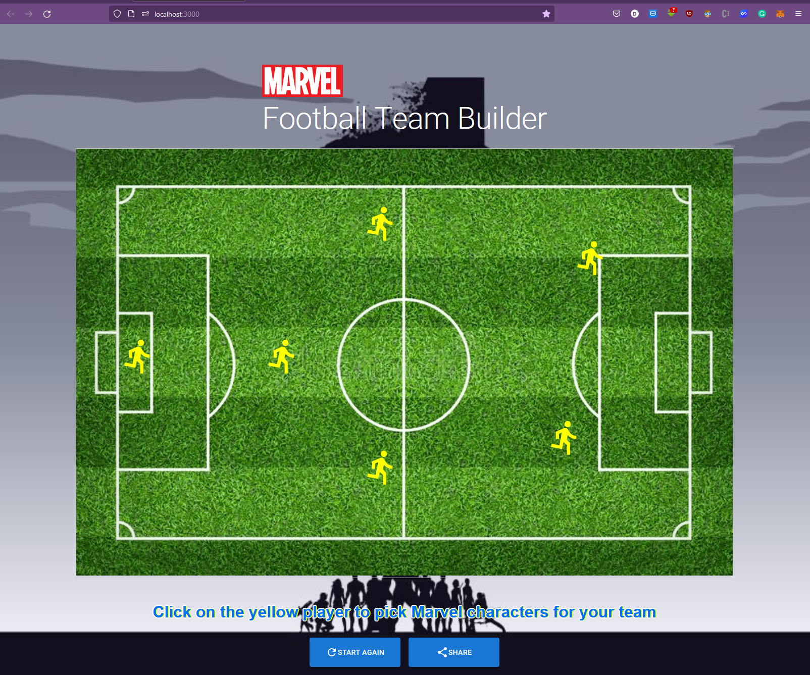
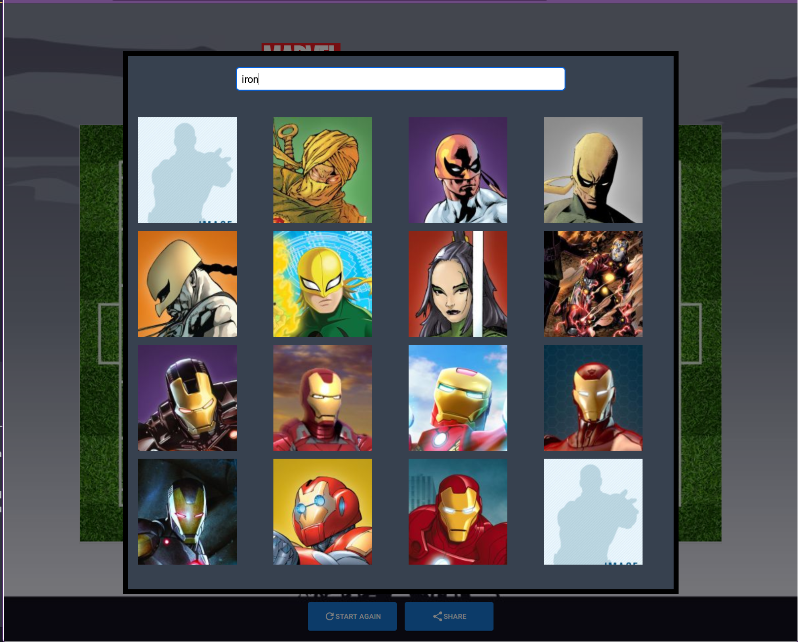

<h3 align="center">Marvel Football Team Builder</h3>


<!-- ABOUT THE PROJECT -->
## About The Project



This is the single page interactive website that was built with Reactjs. It allows the user can build their football team with the Marvel characters. Fetching the data from marvel api and also display the character info.


<!-- INSTALLATION -->

1. Install NPM packages
           ```sh
           npm install
           ```
2. Start the app
          ```sh
           npm start
           ```

<p align="right">(<a href="#top">back to top</a>)</p>


<!-- Some screenshot from the App -->

1. Build team


2. Select the marvel character



3. Share to social media


